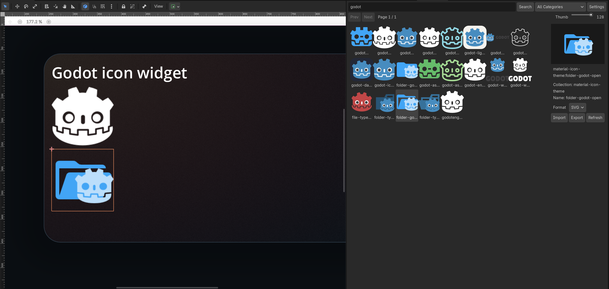

# Godot-icon-widget
 Icon Widget adds an in-editor Iconify browser to Godot: search and preview icons without leaving the editor, then replace the selected widget icon in one click. It also supports local SVG/PNG files and quick import to project folders.

